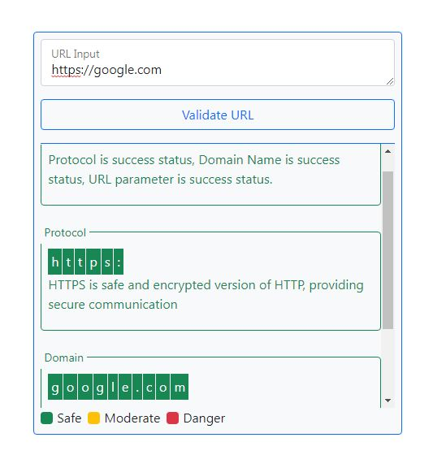

# URL Validator
This is a simple JavaScript based project that checks, detects and validate given URL for possibilities of homograph, homoglyph, IDN and any suspicious format. 

## &#9776; Table of Contents
1. [Introduction](#-introduction)
2. [Screenshots](#-screenshots)
3. [Installation](#-installation)
4. [Usage](#-usage)
5. [Disclaimer](#-disclaimer)
6. [Contribution](#-contribution)
7. [License](#-license)
8. [Contact](#-contact)

## &#9873; Introduction
This is a simple tool that can check, detect and validate given URL for possibilities of homograph, homoglyph, IDN and any suspicious format. It is built with JavaScript, HTML and some CSS and Bootstrap Library.

See [Demo](https://arathinai.blogspot.com/p/url-validator.html).

## &#9873; Screenshots
Here are some screenshots of the project:

## &#9873; Installation
To install the project, follow these steps:

If you want to see demo or run on any device with Internet then follow this [URL Validator](https://arathinai.blogspot.com/p/url-validator.html).

To run on your device then follow the below steps:
- Clone or Download this repository to your local device.
- Navigate to the repository folder and find `index.html` file.
- Run or Open in your browser.

Otherwise to run on your device without Internet then follow the below steps:
- Clone or Download this repository to your local device.
- Navigate to the repository folder and find `index.html` file.
- Download and Add `third-party` libraries and plugins inside the project directory, If required.
- Replace `CDN` links with downloaded library respectively.
- Run or Open in your browser.

## &#9873; Usage
Here are some instructions on how to use the project:

1. This will accept and check `IPv4` address, `IPv6` address and URLs.
2. Enter the web address into the `URL Input` field.
3. Click the `Validate URL` to check and validate.
4. After validation process, this tool will give `report`.
5. The report consist of `protocol`, `domain` and other `URL parameter` related messages.
6. Additionally, report will provide an `overview` on top of it.
7. These report sections gives `three modulation` of alert such as possibility of `safe`, warns about `moderate` and danger alert on `unsafe` address.
8. All modulation of report will be highlighted on `three colors` as `green` variant for possibility of safe, `yellow` variant for possibility of moderate and `red` variant for possibility of unsafe or danger. 
9. This might detect `homoglyph` or `homograph` or `IDN` or `Unicode Domain Phishing URL` address.

Note: For better detection and differentiation with suspicious link, Compare `URL Input` field with `Domain` section message for any difference such as highlighted with `yellow` or `red` variant color, otherwise see for any difference in the characters between them.

## &#9873; Disclaimer
This tool can check and validate given URL. The validation is purely basis on client side, that is on your device. It checks for possibilities of incorrect IP and URL address format given by the user. It might check for possibilities of homoglyph or homograph or IDN or Unicode Domain Phishing related address that look suspicious in your mind. This will perform basic validation and prepare report on basis. But it is never consider as an expert opinion, deep analysis or verification. Following and using this project at your own risk. In no event shall the author or developer be liable for any claim for damages or other liability arising in connection with this software and its by products. 

Examples and screenshots are used here for educational, informational and demonstration purpose only. And it is not shared with the intent to misrepresent or harm or damage to their service or domain. We never want that. But we are used to give awareness to the people who are unaware of that.

Warning!, Don't copy or don't use to try on example addresses without knowing about security risk. Here, given for demonstration purpose only. By the way of using those addresses, any damage or harm takes place in any nature, we will not responsible for that. 

## &#9873; Contribution
Contributions are welcome! If you have any suggestions, bug reports, or feature requests, please open an issue or submit a pull request. Make sure to follow the existing coding style and provide clear documentation for your changes. Before start contribution to the project refer [DOCUMENTATION](./DOCUMENTATION.md).

## &#9873; License
This project is licensed under the [MIT license](LICENSE). Feel free to use, modify, and distribute it as per the terms of the license.

## &#9873; Contact
If you have any questions or need further assistance, please feel free to reach me by referring [My Github Profile](https://github.com/ag-sanjjeev/)
